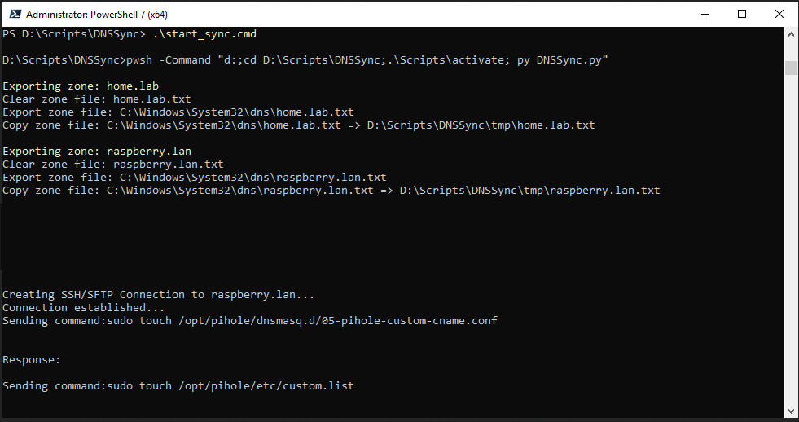
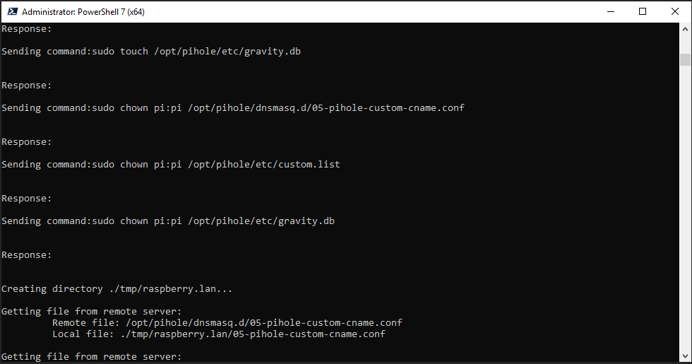
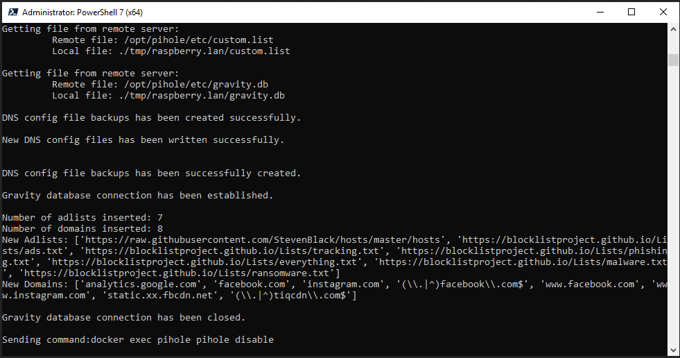
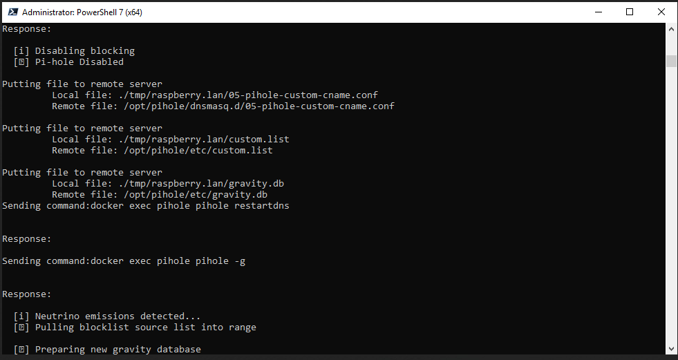
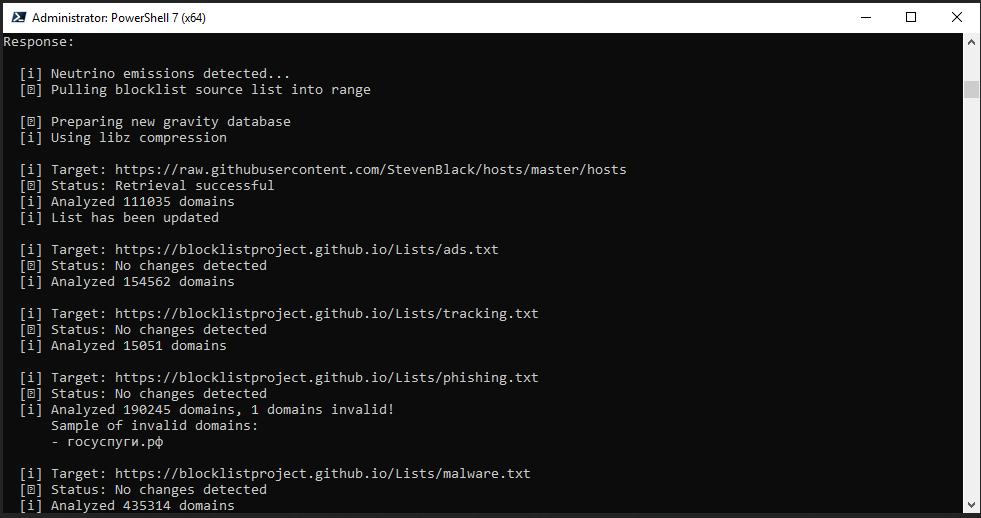
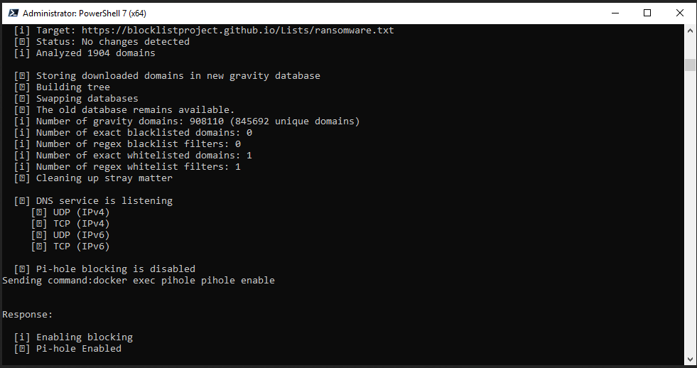
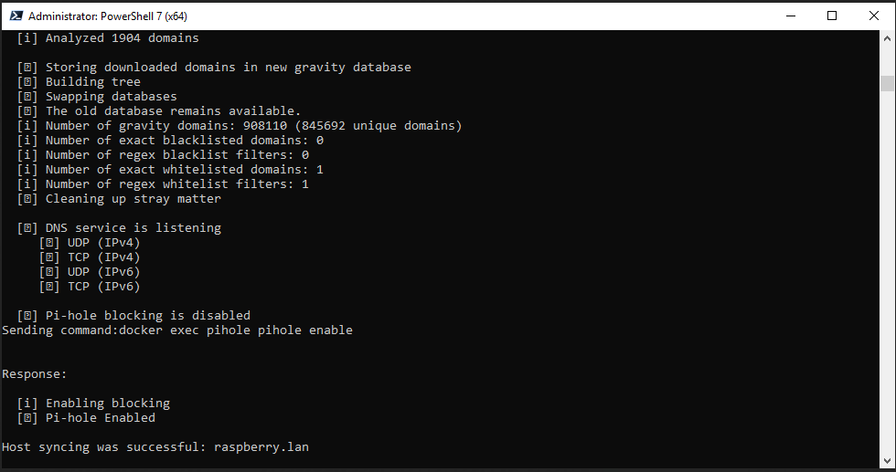

## Description
It's a custom made Pi-Hole (Ad-blocker) syncing algorithm to fullfill my demands to manage Pi-Hole DNS entries and Ad-lists from a Windows Server DNS Service centrally. Somewhat similarly as in Gravity Sync to simplify deployment of new domains and Pi-Hole Ad-list configurations.

### Use at your OWN RISK!

---
## Whats the aim of this script?
* Managing more than 1 instance of Pi-Hole DNS provider from a central location (in this case Windows Server DNS)
---
## What's not the aim of this script?
* File system security
* Fullfill other people's demands :) (Feel free to modify any part of the code!)
---
## What are the requirements?
* Windows Server
    * PowerShell 7
    * Python 3
      * modules:
        ```
        Package         Version
        --------------- -------
        bcrypt          3.2.0
        cffi            1.15.0
        cryptography    36.0.1
        dnspython       2.1.0
        numpy           1.21.5
        pandas          1.3.5
        paramiko        2.9.1
        pip             21.2.4
        pycparser       2.21
        PyNaCl          1.4.0
        python-dateutil 2.8.2
        pytz            2021.3
        setuptools      58.1.0
        six             1.16.0
        ```
* Pi-Hole docker instances (unlimited hosts)
    * accessible SSH ports of the hosts
    * same credentials to the hosts
    * same deployment architecture (Ansible example at the bottom of the page)
    * host access to configuration files (point above)
    * NOPASSWD: sudo option necessary to the managing user
---
## What does the script do?
* Collecting the DNS Zones from Windows DNS
    * Exporting DNS Zones from DNS Service
    * Parsing DNS Zones files
    * Sorting DNS records
    * Connecting to remote servers via SSH
    * Making sure files are exists and setting necessary permissions
    * Pulling gravity.db and DNS zone files
* Syncing DNS zones on the local server
    * Creating a backup file (.bak)
    * Parsing old DNS files
    * Merging DNS files (overwriting or adding domains based on the configuration option in config.py)
* Syncing Gravity database on the local server
    * Creating a backup file (.bak)
    * Connecting to local Gravity database file
    * If overwriting is True drops the necessary tables and recreating them based on the existing schema with the necessary triggers
    * If overwriting is False simply inserts the new adlists and domains
* Disabling Remote Pi-Hole services
* Pushing modified files to the remote servers
* Restarting remote DNS server
* Updating Gravity database engine
* Enabling Remote Pi-Hole services
---
## Improvement ideas
* Separating credentials, include in hosts and separate them in real time running
* Clearing tmp directory before execution (be aware of backup files!!!)
---
## Known bugs
* Pi-Hole Web interface after a time tends to not working for DNS entry deletition
    * Fix:
        ```
        # Removing all entries!!!
        echo "" > /opt/pihole/etc/custom.list
        echo "" > /opt/pihole/dnsmasq.d/05-pihole-custom-cname.conf
        docker restart pihole
        ```
---
## Usage:
* Install PowerShell 7
* Install Python 3
* Edit files accordingly:
    * config.py
        * (parsed)zones
        * zone_files_path
        * target_hosts
        * credentials
        * commands if necessary
        * overwriting behavior
        * deployment paths
        * adlists
        * whitelisted domains
    * start_sync.cmd
        * path of the script
* Run start_sync.cmd (recommended to run from any command line interface to see the result .\start_sync)
---
## Ansible example:
```
---
- hosts: all

  tasks:
  # Installing Pi-Hole
  - name: Create Pi-Hole Directory
    become: yes
    shell: |
      sudo mkdir -p /opt/pihole/{etc,dnsmasq.d}
      sudo chown -R {{ lookup('file', '.ssh/username') }}:{{ lookup('file', '.ssh/username') }} /opt/pihole
    args:
      executable: /bin/bash

    # .ssh/username
    ########################
    # <remote_user_with_nopasswd_sudo_and_docker_management_access>

  - name: Copy Pi-Hole Resolve Configuration
    copy:
      src: conf/resolv.conf
      dest: /opt/pihole/resolv.conf

    # conf/resolv.conf
    ########################
    # nameserver 127.0.0.1 
    # options ndots:0

  - name: Create Pi-Hole Network
    community.docker.docker_network:
      name: pihole

  - name: Deploy Pi-Hole
    community.docker.docker_container:
      name: pihole
      hostname: pihole
      image: pihole/pihole:2021.12.1
      capabilities:
        - net_admin
      ports:
        - "53:53/tcp"
        - "53:53/udp"
        - "67:67/udp"
        - "8080:80/tcp"
      networks:
        - name: pihole
      env:
        TZ: Europe/Budapest
        WEBPASSWORD: '<VERY_SECRET_WEB_PASSWORD>'
        DNSSEC: 'true'
        DNS_BOGUS_PRIV: 'true'
        DNS_FQDN_REQUIRED: 'true'
        REV_SERVER: 'false'
        DNSMASQ_LISTENING: "single"
      volumes:
        - /opt/pihole/resolv.conf:/etc/resolv.conf # Fix for Gravity Update DNS resolution error
        - /opt/pihole/etc:/etc/pihole
        - /opt/pihole/dnsmasq.d:/etc/dnsmasq.d
      healthcheck:
        test: ["CMD-SHELL", "dig +short +norecurse +retry=0 @127.0.0.1 pi.hole || exit 1"]
        # interval: 5s
        # start_period: 5s
        # retries: 3
        # timeout: 3s
      restart_policy: unless-stopped
```
---
## Screenshots






